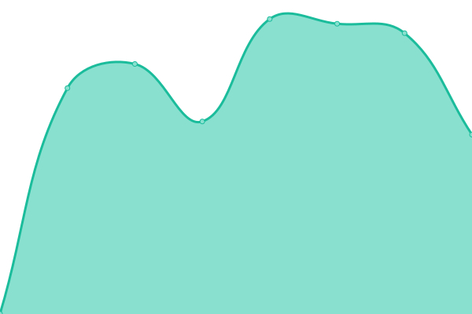
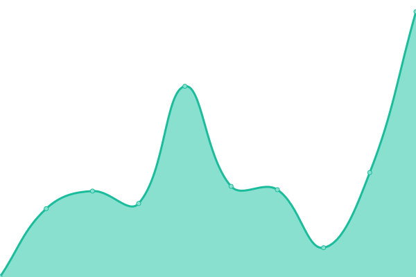
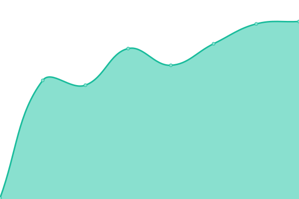
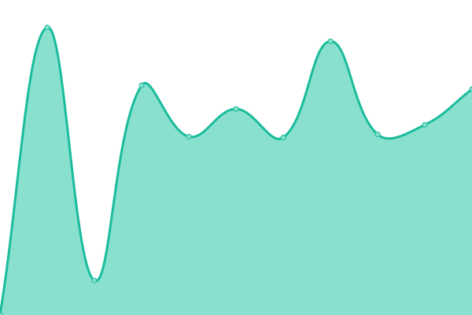
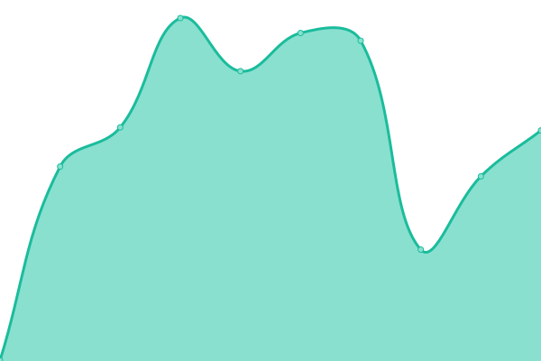

# [📈 Aktuální stav](https://status.studioedison.tk): <!--live status--> **Všechny systémy běží**

This repository contains the open-source uptime monitor and status page for [studioedison](https://status.studioedison.tk), powered by [Upptime](https://github.com/upptime/upptime).

With [Upptime](https://upptime.js.org), you can get your own unlimited and free uptime monitor and status page, powered entirely by a GitHub repository. We use [Issues](https://github.com/studioedison/status.studioedison.tk/issues) as incident reports, [Actions](https://github.com/studioedison/status.studioedison.tk/actions) as uptime monitors, and [Pages](https://status.studioedison.tk) for the status page.

## [📈 Live Status](https://demo.upptime.js.org): <!--live status--> **Všechny systémy běží**

<!--start: status pages-->
<!-- This summary is generated by Upptime (https://github.com/upptime/upptime) -->
<!-- Do not edit this manually, your changes will be overwritten -->
<!-- prettier-ignore -->
| URL | Status | History | Response Time | Uptime |
| --- | ------ | ------- | ------------- | ------ |
|  [Přihlašování](https://auth.studioedison.tk) | Běží | [prihlasovani.yml](https://github.com/studioedison/status.studioedison.cz/commits/HEAD/history/prihlasovani.yml) | 

 1205ms
     
 | 

<a href="https://status.studioedison.cz/history/prihlasovani">99.66%</a>
    

|  [Úkoly (Vikunja)](https://vikunja.studioedison.cz) | Běží | [ukoly-vikunja.yml](https://github.com/studioedison/status.studioedison.cz/commits/HEAD/history/ukoly-vikunja.yml) | 

 595ms
     
 | 

<a href="https://status.studioedison.cz/history/ukoly-vikunja">100.00%</a>
    

|  [Penpot](https://penpot.studioedison.cz) | Běží | [penpot.yml](https://github.com/studioedison/status.studioedison.cz/commits/HEAD/history/penpot.yml) | 

 1108ms
     
 | 

<a href="https://status.studioedison.cz/history/penpot">100.00%</a>
    

|  [Wiki Studia Edison](https://wiki.studioedison.cz) | Běží | [wiki-studia-edison.yml](https://github.com/studioedison/status.studioedison.cz/commits/HEAD/history/wiki-studia-edison.yml) | 

 1181ms
     
 | 

<a href="https://status.studioedison.cz/history/wiki-studia-edison">100.00%</a>
    

|  [Rádio Edison](https://radio.studioedison.cz) | Běží | [radio-edison.yml](https://github.com/studioedison/status.studioedison.cz/commits/HEAD/history/radio-edison.yml) | 

 1260ms
     
 | 

<a href="https://status.studioedison.cz/history/radio-edison">99.58%</a>
    

|  [Poslech Rádia Edison](https://radio.studioedison.cz/listen/radio_edison/) | Běží | [poslech-radia-edison.yml](https://github.com/studioedison/status.studioedison.cz/commits/HEAD/history/poslech-radia-edison.yml) | 

 504ms
     
 | 

<a href="https://status.studioedison.cz/history/poslech-radia-edison">99.58%</a>
    

|  [Televize Edison](https://xibo.studioedison.cz) | Běží | [televize-edison.yml](https://github.com/studioedison/status.studioedison.cz/commits/HEAD/history/televize-edison.yml) | 

 2071ms
     
 | 

<a href="https://status.studioedison.cz/history/televize-edison">100.00%</a>
    

|  [NGINX Proxy Manager](https://npm.studioedison.cz) | Běží | [nginx-proxy-manager.yml](https://github.com/studioedison/status.studioedison.cz/commits/HEAD/history/nginx-proxy-manager.yml) | 

 531ms
     
 | 

<a href="https://status.studioedison.cz/history/nginx-proxy-manager">100.00%</a>
    

|  [Portainer](https://portainer.studioedison.cz) | Běží | [portainer.yml](https://github.com/studioedison/status.studioedison.cz/commits/HEAD/history/portainer.yml) | 

 587ms
     
 | 

<a href="https://status.studioedison.cz/history/portainer">100.00%</a>
    

<!--end: status pages-->

[**Visit our status website →**](https://status.studioedison.tk)

## 📄 License

- Powered by: [Upptime](https://github.com/upptime/upptime)
- Code: [MIT](./LICENSE) © [studioedison](https://status.studioedison.tk)
- Data in the `./history` directory: [Open Database License](https://opendatacommons.org/licenses/odbl/1-0/)
