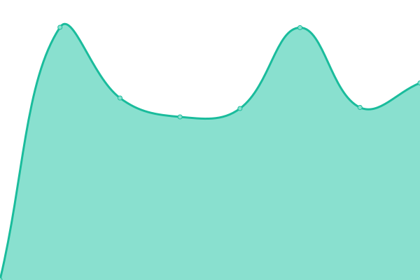

# [📈 Live Status](https://status.studioedison.cz): <!--live status--> **🟩 All systems operational**

This repository contains the open-source uptime monitor and status page for [studioedison](https://status.studioedison.cz), powered by [Upptime](https://github.com/upptime/upptime).

With [Upptime](https://upptime.js.org), you can get your own unlimited and free uptime monitor and status page, powered entirely by a GitHub repository. We use [Issues](https://github.com/studioedison/status.studioedison.cz/issues) as incident reports, [Actions](https://github.com/studioedison/status.studioedison.cz/actions) as uptime monitors, and [Pages](https://status.studioedison.cz) for the status page.

<!--start: status pages-->
<!-- This summary is generated by Upptime (https://github.com/upptime/upptime) -->
<!-- Do not edit this manually, your changes will be overwritten -->
<!-- prettier-ignore -->
| URL | Status | History | Response Time | Uptime |
| --- | ------ | ------- | ------------- | ------ |
|  [Webové stránky](https://studioedison.cz) | 🟩 Up | [webove-stranky.yml](https://github.com/studioedison/status.studioedison.cz/commits/HEAD/history/webove-stranky.yml) | 

 1345ms
     
 | 

<a href="https://status.studioedison.cz/history/webove-stranky">88.95%</a>
    

|  [Statický web](https://static.studioedison.cz) | 🟩 Up | [staticky-web.yml](https://github.com/studioedison/status.studioedison.cz/commits/HEAD/history/staticky-web.yml) | 

 482ms
     
 | 

<a href="https://status.studioedison.cz/history/staticky-web">99.70%</a>
    

|  [Přihlašování](https://sso.studioedison.cz) | 🟩 Up | [prihlasovani.yml](https://github.com/studioedison/status.studioedison.cz/commits/HEAD/history/prihlasovani.yml) | 

 767ms
     
 | 

<a href="https://status.studioedison.cz/history/prihlasovani">99.70%</a>
    

|  [Penpot](https://penpot.studioedison.cz) | 🟩 Up | [penpot.yml](https://github.com/studioedison/status.studioedison.cz/commits/HEAD/history/penpot.yml) | 

 906ms
     
 | 

<a href="https://status.studioedison.cz/history/penpot">99.70%</a>
    

|  [Portainer](https://port.studioedison.cz) | 🟩 Up | [portainer.yml](https://github.com/studioedison/status.studioedison.cz/commits/HEAD/history/portainer.yml) | 

 568ms
     
 | 

<a href="https://status.studioedison.cz/history/portainer">99.70%</a>
    

|  [Vikunja](https://vikunja.studioedison.cz) | 🟩 Up | [vikunja.yml](https://github.com/studioedison/status.studioedison.cz/commits/HEAD/history/vikunja.yml) | 

 451ms
     
 | 

<a href="https://status.studioedison.cz/history/vikunja">99.70%</a>
    

|  [Wiki](https://wiki.studioedison.cz) | 🟩 Up | [wiki.yml](https://github.com/studioedison/status.studioedison.cz/commits/HEAD/history/wiki.yml) | 

 614ms
     
 | 

<a href="https://status.studioedison.cz/history/wiki">99.70%</a>
    

|  [Xibo](https://xibo.studioedison.cz) | 🟩 Up | [xibo.yml](https://github.com/studioedison/status.studioedison.cz/commits/HEAD/history/xibo.yml) | 

 1358ms
     
 | 

<a href="https://status.studioedison.cz/history/xibo">98.62%</a>
    

<!--end: status pages-->

[**Visit our status website →**](https://status.studioedison.cz)

## 📄 License

- Powered by: [Upptime](https://github.com/upptime/upptime)
- Code: [MIT](./LICENSE) © [studioedison](https://status.studioedison.cz)
- Data in the `./history` directory: [Open Database License](https://opendatacommons.org/licenses/odbl/1-0/)
